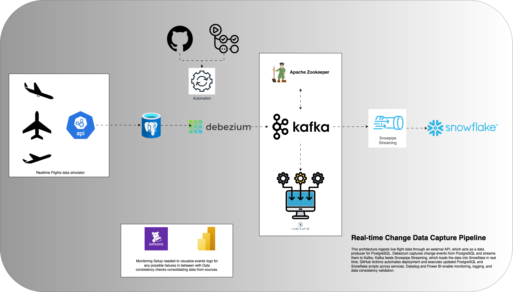

# 🛰️ Real-time Change Data Capture (CDC) Pipeline

## Overview

This project demonstrates a **real-time Change Data Capture (CDC) pipeline** for ingesting and analyzing live flight data. It is designed to reflect a modern, production-grade data engineering stack that can handle high-velocity streaming data, preserve transactional consistency, and power downstream analytics in near real time.

The goal is to replicate changes happening in a **PostgreSQL** database — populated from a live **external API** — and stream those changes all the way into **Snowflake**, where analytical dashboards or BI tools can consume them.

---



## Why This Project?

In today’s data-driven environments, **batch pipelines** are often not fast enough. Businesses need:
- **Real-time insight** into operations
- **Immediate responses** to data changes
- **Decoupled microservices** powered by streams

This project simulates such a system — starting from an external data source and ending at an analytical warehouse, with a fully automated and scalable pipeline in between.

---

## Architecture

The CDC pipeline consists of several key components:

### 🔄 1. Data Source – Flight API
A live aviation API (e.g., OpenSky) continuously provides real-time flight data such as aircraft positions and statuses. This data simulates the operational system of a business (e.g., a realtime flights data coming from sensors etc).

### 🗄️ 2. PostgreSQL
The API ingests data into a transactional PostgreSQL database. It behaves like a source-of-truth OLTP system where inserts/updates/deletes occur frequently.

### 🔁 3. Debezium + Kafka
Debezium monitors the PostgreSQL write-ahead log (WAL) and captures row-level changes in real time. These changes are streamed into Kafka topics for further processing.

### 🔌 4. Kafka Connect + Snowflake Sink Connector
Kafka Connect reads change records from Kafka topics and streams them into Snowflake using the official Snowpipe streaming. The data lands in analytical tables, ready for querying.

### 🧊 5. Snowflake
Snowflake acts as the real-time analytical engine. As changes propagate from the source, Snowflake remains consistently up to date with the latest state of the operational data.

### ⚙️ 6. GitHub Actions
All relevant scripts (e.g., Snowflake DDLs, connectors) are managed via GitHub Actions to automate deployment and integration workflows.

---

## Key Technologies

| Component           | Technology                        |
|---------------------|-----------------------------------|
| Data Source         | OpenSky API (live flight data)    |
| Database            | PostgreSQL                        |
| Change Data Capture | Debezium                          |
| Messaging System    | Apache Kafka                      |
| Stream Integration  | Kafka Connect + Snowflake Sink    |
| Data Warehouse      | Snowflake                         |
| Containerization    | Docker Compose                    |
| CI/CD               | GitHub Actions                    |

> 💡 **Note:** While this project was implemented in a local environment to avoid cloud infrastructure costs, it can be fully migrated to **AWS** using managed services such as:
>
> - Amazon RDS (for PostgreSQL)
> - Amazon MSK (Managed Kafka)
> - Amazon ECS or EKS (for container orchestration)
>
> This architecture was intentionally built locally for educational and cost-efficiency purposes, but can be scaled easily to the cloud.

---

## How Data Flows

1. External API pushes real-time flight data → PostgreSQL
2. Debezium detects changes in PostgreSQL (insert/update/delete)
3. Kafka receives CDC events from Debezium topics
4. CDC events from Kafka topics are ingested into Snowflake in near real-time via Snowpipe Streaming
5. GitHub Actions ensures automated deployment across
6. Analysts can query real-time data in Snowflake for insights

---

## Real-World Applications

- **Operational Analytics**: Monitor live business operations such as sales performance, customer activity, or system health to enable fast decision-making.
- **Customer 360 Profiles**: Continuously update customer profiles by integrating real-time transaction, interaction, and behavioral data for personalized marketing and support.
- **Fraud Detection & Compliance**: Analyze transactional data streams in near real-time to detect suspicious patterns, enforce compliance, and trigger alerts.
- **Inventory and Supply Chain Management**: Track stock levels, supplier shipments, and warehouse logistics dynamically to optimize supply chain efficiency.
- **Financial Services**: Real-time reconciliation, risk management, and trade analytics for banking, insurance, and investment firms.
- **IoT and Sensor Data Integration**: Ingest device telemetry and sensor data for monitoring, predictive maintenance, or smart automation.
- **Customer Support & Ticketing**: Update and analyze support tickets, service requests, and customer feedback in real time to improve responsiveness.
- **Marketing & Campaign Analytics**: Measure campaign performance, website clicks, and user engagement live to optimize ad spend and targeting.
- **Healthcare Monitoring**: Integrate patient vitals, lab results, and appointment data for real-time monitoring and decision support.
- **Telecommunications**: Monitor call records, network events, and user sessions continuously for quality assurance and capacity planning.

---

## Future Improvements

- Add schema versioning and validation with Avro + Schema Registry to formalize data structures in snowflake
- Add further github actions automation to enhance automated deployments across all services  
- Implement data quality checks before writing to Snowflake  
- Build a lightweight monitoring dashboard using Datadog or Power BI.  

---

## How to Set this project?

1. Clone the Repository.
2. Replace relevant environment variables with the correct configurational & functional variables.
3. Download the snowflake-kafka-connector jar in kafka-plugins directory via curl command 

<br>

```bash
curl -O https://repo1.maven.org/maven2/com/snowflake/snowflake-kafka-connector/2.0.0/snowflake-kafka-connector-2.0.0.jar
```

<br>


<br>

4. Run the relevant postgresql pre requisite scripts

<br>


<br>

5. We can use debezium UI accessible on [[Debezium UI](http://localhost:8080/#app/)] to create new connector or we can do this via the API call
```bash
curl -X POST -H "Content-Type: application/json" --data '{
  "name": "flights",
  "config": {
    "connector.class": "io.debezium.connector.postgresql.PostgresConnector",
    "topic.prefix": "cdc",
    "database.user": "postgres",
    "database.dbname": "flights",
    "database.sslmode": "disable",
    "database.hostname": "postgres",
    "database.password": "********",
    "plugin.name": "pgoutput",
    "name": "flights"
  }
}' http://localhost:8093/connectors
```
<br>


<br>

6. Now configure the snowflake_test_config.json file with the relevant connection details, this will be used to setup kafka snowpipe streaming connection.
```bash
curl -X POST -H "Content-Type: application/json" \
--data @snowflake_test_config.json \
http://localhost:8093/connectors
```
<br>


<br>

7. Run the dummy data producer python file.

<br>


<br>

On Confluent CC, We can observe kafka topics capturing postgresql data.

<br>


<br>

Data in Postgres:

<br>


<br>

Data in Snowflake:
<br>


<br>

Data Latency Check:  

<br>

 

<br>
The real-time data system exhibits a latency of approximately 9.51 seconds. While not instantaneous, this lag of around 9 seconds might be acceptable depending on the specific application's requirements, but it could still impact use cases demanding near-instantaneous data.
<br>
---

## Author

**Muhammad Azeem Khan**  
Full Stack Data Engineer 
[[LinkedIn](https://www.linkedin.com/in/mazeemkhanreal/)] | [[Website](https://mazeemkhanreal.github.io/resume/)] | [mazeemkhanq@gmail.com]
